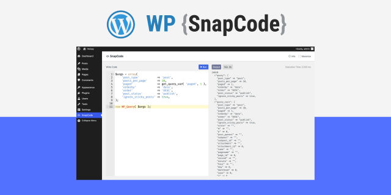

# SnapCode

Run WordPress code instantly without a code editor

**Features**

* Easy and simple UI
* Execute PHP and WordPress code instantly
* Test any plugin code snippet or helper
* Get immediate output
* Shows queries for executed code.
* Skip the step of creating a separate PHP file for testing function calls

**Want to try?**
[See Demo](https://playground.wordpress.net/?blueprint-url=https://raw.githubusercontent.com/haruncpi/snapcode/master/blueprint.json)

**Download Plugin**
[WP SnapCode](https://github.com/haruncpi/snapcode/releases)

**Why Isn’t This on WordPress.org?**

The answer is policy, not quality. The official WordPress.org plugin team no longer allows plugins that let you run arbitrary PHP code from inside the admin for security reasons. There is an older plugin named WP-Console that still exists because it was added before these restrictions came into effect, but new submissions with similar functionality are no longer accepted.

That’s why *SnapCode* is hosted on GitHub — being open-source ensures full transparency.
